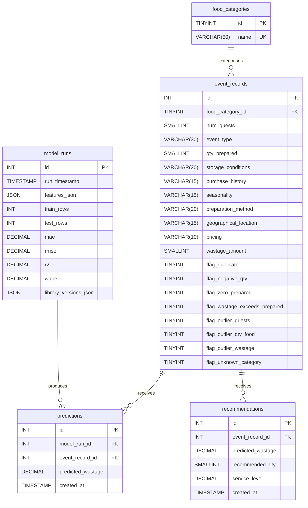

# Spec 1: data-foundation — Design

## Module boundaries

```
src/
├── __init__.py
├── pipeline.py      CLI entry point; orchestrates validate → clean → load
├── validate.py      Schema and constraint checks; returns a ValidationResult
├── clean.py         Applies flags and exclusions; returns a CleanResult
└── loader.py        Reads processed CSV, upserts into MySQL
```

Each module exposes pure functions that accept a DataFrame and return a result object. No module imports another's result type — data flows as DataFrames with added flag columns.

## Validation flow

```
raw DataFrame
    │
    ▼
validate_schema()       checks columns present, dtypes correct
    │
    ▼
validate_constraints()  checks negatives, zeros, wastage > prepared,
                        unknown categories, duplicate rows, outliers
    │
    ▼
ValidationResult        named fields: schema_ok, issues (list of Issue)
                        each Issue has: check_name, row_count, row_indices, treatment
```

`validate_constraints` is deterministic: same input always produces same output. It never mutates the DataFrame.

## Cleaning and flagging flow

```
raw DataFrame + ValidationResult
    │
    ▼
assign_flags()          adds boolean flag columns from ValidationResult
    │
    ▼
apply_exclusions()      marks rows excluded from model training
    │
    ▼
CleanResult             flagged_df (all rows + flag columns)
                        excluded_df (rows excluded from training)
                        reconciliation dict (raw_in, flagged_n, excluded_n, clean_out)
```

`clean_events.csv` contains all rows — flagged and unflagged — so the analyst can inspect everything. Model training reads only rows where no exclusion flag is set.

## MySQL schema (ER diagram)



## Loader flow

```
data/processed/clean_events.csv
    │
    ▼
read_csv()
    │
    ▼
upsert food_categories (INSERT IGNORE)
    │
    ▼
bulk upsert event_records (INSERT … ON DUPLICATE KEY UPDATE)
    │
    ▼
verify_load()   queries MySQL, compares row count + sums vs CSV
                exits non-zero on mismatch
```

The loader uses SQLAlchemy Core (not ORM) for the bulk upsert to keep the insert path fast and the SQL visible.

## EDA notebook structure

| Notebook | Contents |
|---|---|
| `01_data_overview.ipynb` | Shape, dtypes, missing values, distributions, flag summary |
| `02_waste_analysis.ipynb` | Wastage % by food type, event type, pricing, location, seasonality, guest bands, heatmap |
| `03_drivers.ipynb` | Preparation method, storage conditions, purchase history, confounding cross-tabs, effect sizes |

Each notebook queries MySQL via SQLAlchemy. Charts are produced with Matplotlib/Seaborn, saved to `outputs/` via `plt.savefig`, and displayed inline.

## Data quality report structure

`reports/data_quality_report.md` sections:
1. Dataset summary (shape, columns, dtypes)
2. Column comparison (expected vs actual)
3. Distinct values per categorical
4. Constraint check results (one subsection per check)
5. Treatments applied (one row per treatment with reason)
6. Row-count reconciliation table
